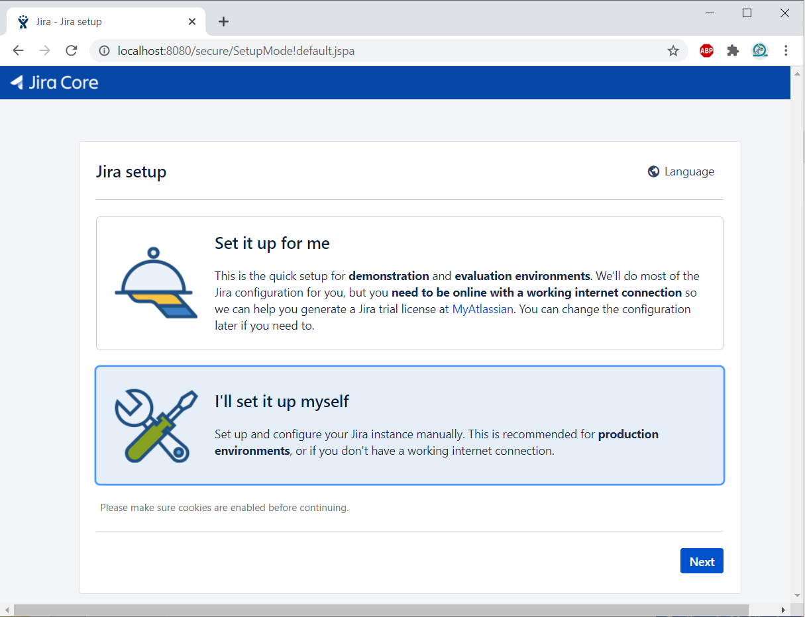

# Setting up the Jira instance
This directory holds the docker volume for the Jira container (i.e. /var/atlassian/application-data/jira)

Once you have verified the container is running:

1. Navigate to `http://localhost:8080/`

2. Select `I'll set it up myself`

